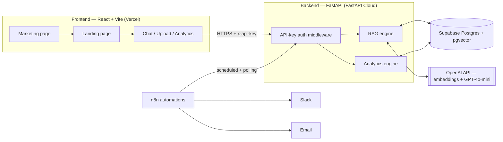
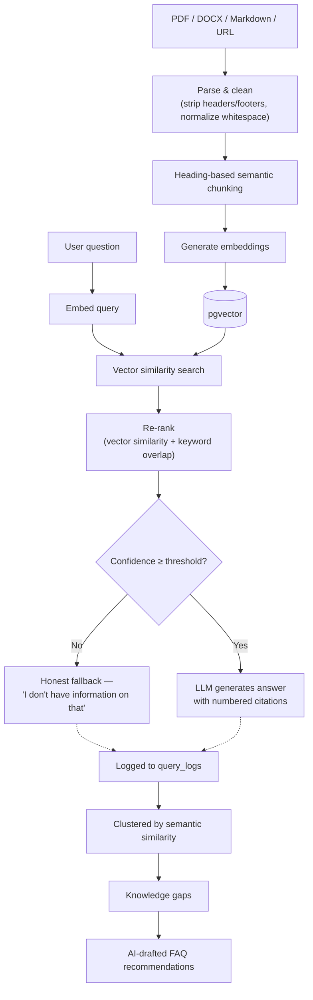

# RAG-Powered Customer Support Knowledge Assistant

An AI support assistant that answers customer questions directly from your own documents — with **real citations**, **honest fallback** when it doesn't know, and a built-in **knowledge-gap intelligence layer** that tells you what your documentation is missing.

**Live demo:** https://rag-powered-customer-support-knowle.vercel.app
**API:** https://rag-powered-customer-support-knowledge-assistant.fastapicloud.dev
**Repo:** https://github.com/SharonSilva/RAG-Powered-Customer-Support-Knowledge-assistant

---

## What makes this different

Most RAG chatbot demos stop at "upload a doc, ask a question." This project goes further:

- **Every answer is cited** — traceable back to the exact document and section it came from.
- **It says "I don't know"** instead of guessing, using a calibrated confidence threshold on retrieval + re-ranking scores.
- **It learns what it's missing** — every unanswered question is clustered by semantic similarity, surfaced as a tracked "knowledge gap," and turned into an AI-drafted FAQ suggestion for human review.
- **It measures its own health** — a composite Knowledge Health Score (answer rate + user feedback + gap-closure rate) tracks whether the knowledge base is actually improving over time.
- **It's automated end-to-end** — n8n workflows deliver a weekly health report by email and Slack-alert a human when customer feedback flags a bad answer.

---

## Architecture



## Ingestion & retrieval pipeline



---

## Tech stack

| Layer | Technology |
|---|---|
| Frontend | React, TypeScript, Vite |
| Backend | FastAPI (Python) |
| Database | PostgreSQL + pgvector (Supabase) |
| AI | OpenAI `text-embedding-3-small`, GPT-4o-mini |
| Auth | API-key middleware |
| Backend hosting | FastAPI Cloud |
| Frontend hosting | Vercel |
| Automation | n8n (scheduled reports, Slack alerts) |

---

## Core capabilities

### 1. Multi-format ingestion
Upload PDF, DOCX, or Markdown files, or point it at a URL. Each format is parsed into a common structure, cleaned (repeated headers/footers stripped, whitespace normalized), and chunked by detected heading/section — not naive fixed-size splitting, which cuts sentences mid-thought.

### 2. Retrieval with re-ranking
Query embeddings are matched against stored chunks via cosine similarity in pgvector, then re-ranked using a blend of vector similarity and keyword overlap — catching exact-term matches that pure semantic search can miss.

### 3. Grounded generation with citations
The LLM is instructed to answer *only* from retrieved context and cite every claim. If retrieval confidence falls below a calibrated threshold, the system returns an honest fallback instead of guessing.

### 4. Knowledge-gap analytics
Every question is logged with its embedding, score, and outcome. Unanswered questions are clustered by semantic similarity to reveal recurring gaps, which the LLM turns into draft FAQ suggestions (with `[BRACKETS]` marking what the business needs to fill in — never inventing facts).

### 5. Feedback & escalation
Thumbs-down feedback on an answer automatically flags it for human review — a lightweight, built-in equivalent to ticket escalation.

### 6. Knowledge Health Score
A single composite number (answer rate × 50% + feedback score × 30% + gap-closure rate × 20%) that tracks whether the knowledge base is genuinely improving.

### 7. Automation via n8n
- **Weekly Knowledge Health Report** — scheduled email summarizing score, fallback rate, and trend.
- **Flagged-Query Alerts** — polls for new flagged queries and posts to Slack, with built-in deduplication so the same issue isn't reported twice.

---

## API overview

| Endpoint | Method | Purpose |
|---|---|---|
| `/upload` | POST | Ingest a PDF/DOCX/Markdown file |
| `/ingest-url` | POST | Ingest content from a URL |
| `/ask` | POST | Ask a question, get a grounded, cited answer |
| `/query` | POST | Raw retrieval results (debugging) |
| `/query-logs/{id}/feedback` | PATCH | Submit up/down feedback on an answer |
| `/analytics/summary` | GET | Overall stats + Knowledge Health Score |
| `/analytics/gaps` | GET | Clustered knowledge gaps |
| `/analytics/recommendations` | GET/POST | AI-drafted FAQ recommendations |
| `/analytics/recommendations/{id}` | PATCH | Approve/reject a recommendation |
| `/analytics/flagged` | GET | Queries flagged via negative feedback |

All endpoints except `/health` require an `x-api-key` header.

---

## Local development

**Backend:**
```bash
cd RAG-Powered-Customer-Support-Knowledge-assistant
python3 -m venv venv && source venv/bin/activate
pip install -r requirements.txt
# set DATABASE_URL, OPENAI_API_KEY, API_KEY in .env
python3 init_db.py
uvicorn app.main:app --reload
```

**Frontend:**
```bash
cd frontend
npm install
# set VITE_API_BASE_URL, VITE_API_KEY in .env
npm run dev
```

---

## Project structure

```
.
├── app/
│   ├── main.py                  # FastAPI app, routes, CORS, auth middleware
│   ├── models.py                # SQLAlchemy models
│   ├── database.py              # DB connection
│   └── services/
│       ├── parsing.py           # PDF parsing + cleaning
│       ├── docx_parsing.py      # DOCX parsing
│       ├── markdown_parsing.py  # Markdown parsing
│       ├── url_parsing.py       # URL/HTML parsing
│       ├── chunking.py          # Heading-based chunking
│       ├── embedding.py         # OpenAI embeddings
│       ├── retrieval.py         # pgvector similarity search
│       ├── reranking.py         # Vector + keyword re-ranking
│       ├── generation.py        # Grounded answer generation
│       ├── clustering.py        # Gap clustering
│       ├── recommendations.py   # AI FAQ drafting
│       ├── impact_analytics.py  # Fallback-rate trends
│       └── health_score.py      # Knowledge Health Score
└── frontend/
    └── src/
        ├── pages/
        │   ├── Marketing.tsx     # Entry marketing page
        │   └── Landing.tsx       # Product landing page
        ├── components/
        │   ├── ChatPanel.tsx
        │   ├── UploadPanel.tsx
        │   └── AnalyticsDashboard.tsx
        └── api.ts                # Backend API client
```

---

## Author

Built by [Sharon Silva](https://github.com/SharonSilva).